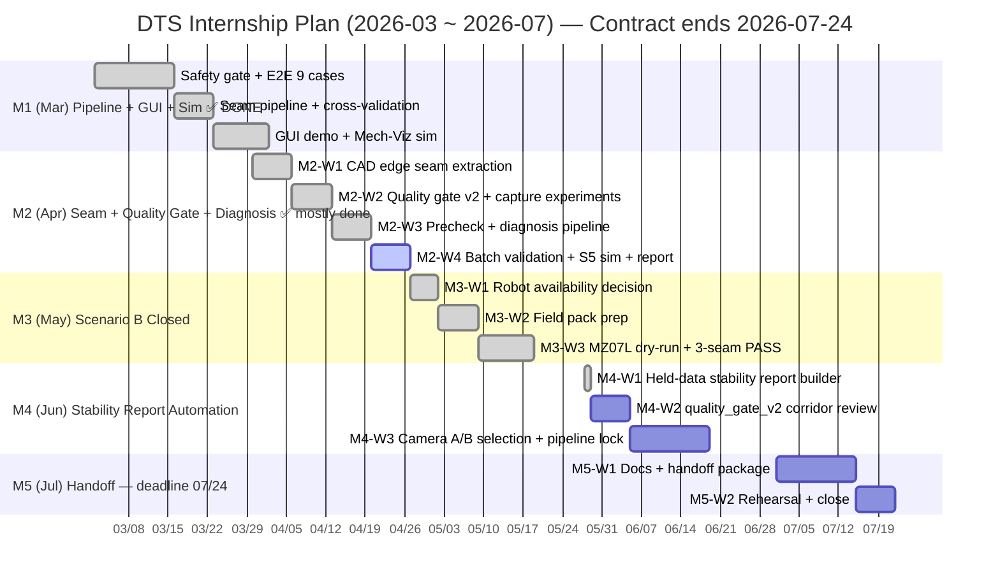

# DTS 프로젝트 마일스톤 (2026.03 ~ 2026.07)

> **한 줄 목표**: 사람이 직접 찍어주던 용접 경로를, 카메라로 찍고 자동으로 만들어 로봇에 안전하게 넣어주는 시스템을 완성한다.

> **기간 제약**: 인턴 계약 종료 **2026-07-24**. 7월은 정리/인수인계 기간. 실질 개발은 3~6월(4개월).

---

## 배경 — 지금까지 무엇을 만들었나

| 시기 | 완료 내용 | 의미 |
|------|-----------|------|
| ~2월 | 로봇이 신호를 보내면 → DTS가 받아서 → 경로를 판단하고 → 안전하게 전달하는 **실행 기반** 완성 | "경로 데이터만 넣으면 바로 로봇에 보낼 수 있는 파이프" 가 준비된 상태 |
| 3월 | **경로 자동 생성 파이프라인 + GUI 데모 + Mech-Viz 시뮬 검증 완료** | 촬영→ICP→경로 생성→보정→시뮬까지 전체 플로우 동작 확인. M1 실질 완료 |
| 4월~ | **생산 seam 확정 + Mech-Viz cell 정교화 + 안정성 검증** 진입 | 테스트 seam → CAD edge 기반 생산 seam 전환, 시뮬 품질 향상 |

---

## 마일스톤 한눈에 보기

| # | 기간 | 핵심 목표 | 완료 기준 |
|---|------|-----------|-----------|
| M1 | 3월 | **안전 게이트 선결 + Mech 경로 자동생성 1회 통과** (cam2는 가용 시 1회 취득) | 상태 코드/차단 정상 동작 + Mech 파이프라인 1회 통과 + 정량지표 저장 + 재현 스크립트 |
| M2 | 4월 | 운영 후보 seam 확정 + 정합 품질 자동화 + 기본 시뮬 검증 | seam 3종 확정 + quality gate v2 + precheck/diagnosis + batch 검증 + S5 시뮬 1회 |
| M3 | 5월 | 시나리오 B로 종결 — 본사 실로봇 검증은 현재 범위에서 제외, 로컬 시뮬 + 현장 실행 패키지로 마감 | 5/26 3-seam phase3_first5 PASS + 현장 실행 패키지 30~60분 내 재현 |
| M4 | 6월 | **보유 데이터 기준 안정성 리포트 자동화** | 보유 캡처 12+개 대상 반복 측정 결과 변동 폭 자동 산출 + 리포트 1건 |
| M5 | 7/1~7/24 | **인수인계 가능한 문서화 + 30분 재현 패키지 마무리** | 처음 보는 사람이 문서만 보고 30분 내 실행 가능 + 단일 명령 rehearsal 래퍼 PASS |

### 완료 기준 기본값(공통)

- 충돌/도달불가: 0건
- flip: 구간 간 자세 변화량 5° 이내
- 보유 캡처 안정성: 부위별 mean_nn_mm 변동 폭 자동 산출 (M3 시나리오 B 종결 이후 *새 캡처 5회 반복 실행* 기준은 제거)
- 패키지 실행: 30~60분 이내

### 간트 차트 (의존성 포함)

---

## M1 — 경로 자동 생성 파이프라인 + GUI 데모 + 시뮬 검증 (3월) ✅ 완료

### 완료 요약 (2026-03-23 기준)

M1은 당초 계획보다 범위가 확대되어 완료됨. 안전 게이트 선결 + Mech 경로 1회 통과를 넘어, **GUI 데모 + Mech-Viz 시뮬 + cross-validation**까지 달성.

### 실제 달성 내역

| 항목 | 결과 |
|------|------|
| 안전 게이트 | E2E 9케이스 PASS (OK/NG/NG_AVG/STALE/INVALID/ICP_LOW/ICP_HIGH/ICP_BAD/ICP_MISSING) |
| 카메라 촬영 | Mech-Eye SDK 2.5.4 연동, organized PLY 저장, 4개 캡처(978/741/763/473) |
| CAD 정합 + 경로 생성 | battery-case seam pipeline: ref PCD → ICP → seam transform → Euler pose → 1100 |
| Cross-validation | 978: U1 mean NN=0.599mm / 741: 1.072mm / 763: 1.070mm / 473: out-of-window |
| Mech-Viz 시뮬 | U1+U2 (91 poses) HS-180 External Move — 충돌 0, 오류 0, smooth motion |
| GUI 데모 | 촬영→ICP→경로 생성→보정 비교→E2E→Viz export/시뮬 한 화면 동작 |
| 테스트 | Python 164 tests PASS, C# 빌드 OK |
| 데이터 검증 | 데이터 오염 검토 완료, capture-conditioned bias 문서화 |

### 미달성 / 이월
- cam2 비교 카메라: 기종 미확정으로 이월 (Mech 단독 진행)
- 생산 seam 정의: 테스트 seam(U1/U2)으로 파이프라인 검증. CAD edge 추출은 M2로 이월

### 회사에 요청할 항목

| 항목 | 내용 | 요청 마감 | 없으면 대체 방법 |
|------|------|-----------|-----------------|
| **비교 카메라 기종 확정** | 어떤 카메라로 비교할지 결정 (모델명, SDK 제공 여부) | **⚠️ 2월 말** | Mech 카메라 단독으로 먼저 진행, 비교 카메라는 4월로 연기 |
| **비교 카메라 SDK/드라이버** | 설치 파일, 샘플 코드, 문서 | **⚠️ 2월 말** | 미제공 시 카메라 비교 항목 M2로 이월 |
| **CAD 파일** | 테스트 대상 제품의 CAD(STEP 또는 STL/OBJ/PLY) | **⚠️ 2월 말** | 과거 데이터/샘플 파일로 임시 진행 (M1 정합 불가) |
| **실물 샘플 제품** | 촬영 테스트용 실물 최소 1개 (가능하면 2~3개) | **⚠️ 2월 말** | 과거 PCD 데이터로 오프라인 테스트 |
| **용접선(seam) 정의** | "이 제품의 어느 선을 용접한다" 도면 또는 설명 1장 | **⚠️ 2월 말** | 도면 없으면 CAD에서 임의 엣지 추출 후 확인 요청 |
| **촬영 환경** | 카메라 고정 지그/삼각대, 안정적인 촬영 공간 (높이·거리 고정 가능한 곳) | **⚠️ 2월 말** | 임시 고정 방법으로 진행하되 재현성 한계 기록 |
| **좌표계/단위 기준** | CAD 단위(mm/m), 카메라 출력 단위(mm/m), 카메라 축 방향(Z가 앞/뒤?) | **⚠️ 2월 말** | 직접 측정으로 추정 후 결과에 불확실성 기록 |
| **개발 PC + 권한** | Windows PC, 관리자 권한(포트 개방용), 공용 폴더 경로 1개 | **⚠️ 2월 말** | WSL 환경 우선 진행 |

> ⚠️ **기한 주의**: 위 항목은 M1 시작 전 준비 완료가 필요. 3월 1주차에 M1이 시작되므로 요청은 2월 말까지 완료해야 함. 미확보 항목은 개발 블로킹 발생.

---

## M2 — 운영 후보 seam 확정 + 정합 품질 자동화 + 기본 시뮬 검증 (4월)

### 무엇을 하나

M1에서 테스트 seam(U1/U2)으로 전체 파이프라인 동작을 검증했으므로, M2에서는:
1. **운영 후보 seam 정의**: CAD edge 추출 기반 seam 세트 확정 (U1_right/U2_left/S5)
2. **정합 품질 자동화**: quality gate v2 확정, alignment precheck + diagnosis, batch 검증
3. **촬영 조건 실험**: 75° + HDR baseline 5회 반복, REG 실험, 45° fail 확인
4. **기본 시뮬 검증**: 운영 후보 seam 전체(U1/U2/S5)에 대해 도달/충돌 기본 확인

> M1에서 이미 달성: Mech-Viz 시뮬 기본 동작 (U1+U2 충돌 0), pose_to_viz.py 변환, GUI→Viz export/시뮬 연동

> Cell 정교화(토치 충돌 모델, 지그/테이블/장애물, TCP 정밀도)는 M3 초에 실로봇 가용성 판단과 함께 진행. 현장 좌표/TCP가 없는 상태에서 정교화해도 "정교한 임시 환경"이 되므로, 실로봇 정보가 확보된 후 한 번에 진행하는 것이 효율적.

### 왜 중요한가

테스트 seam으로 "파이프라인이 동작한다"는 증명했지만, 운영용으로 쓰려면 **정확한 용접선 위치 + 자동 품질 판정 + 실패 원인 분류**가 필요하다. M2는 파이프라인의 신뢰성을 확보하는 단계다.

### 산출물

| 파일 | 내용 |
|------|------|
| `quality_gate_v2_2026-04-08.json` | 12-capture baseline 기반 임계값 ✅ |
| `dts/icp.py: alignment_precheck + diagnose_alignment` | 사전 차단 + 자동 진단 ✅ |
| batch validation summary (표) | 전체 capture 일괄 검증 결과 |
| `SIM_REPORT.md` (간단판) | U1/U2/S5 기본 시뮬 결과 — 표 + 스크린샷 + 한 줄 결론 |

### 완료 기준

- [x] 운영 후보 seam 3종(U1_right/U2_left/S5) CAD edge 기반 정의 완료
- [x] Quality gate v2 확정 (12-capture refinement baseline)
- [x] Alignment precheck + diagnosis 자동화 (164 tests PASS)
- [x] 촬영 조건 실험 완료 (75°/HDR 5회 반복, REG, 45° fail)
- [x] Batch validation — 21 캡처 일괄 검증 완료 (GOOD 17, ACCEPTABLE 4, BLOCK 0)
- [ ] S5 Mech-Viz 기본 시뮬 1회 (충돌/도달 확인)
- [ ] SIM_REPORT.md 간단판 (U1/U2/S5 결과 표 + 스크린샷)

### 이월 항목 (→ M3)

- Mech-Viz cell 정교화: 토치 충돌 모델, 지그/테이블/장애물, TCP 오프셋
- 시뮬 품질 향상: 접근/이탈 경로, 구간별 flip 검사, 시뮬 영상
- U2_left seam 재정의 (CloudCompare 검증 후)

### 회사에 요청할 항목

| 항목 | 내용 | 요청 마감 | 없으면 대체 방법 |
|------|------|-----------|-----------------|
| **Mech-Viz 라이선스 + 설치 PC** | 시뮬레이션 실행 가능한 환경 | **3월 말** | M1 기간 중 RoboDK 무료 체험판으로 로봇 모델 + 경로 변환 프로토타입 사전 준비. 3월 말까지 Viz 미확보 시 RoboDK로 M2 진행 (별도 계획 불필요) |
| **로봇 모델 파일 (HS-180)** | Mech-Viz용 로봇 패키지 또는 URDF/OLP 모델 | 3월 말 | Hyundai Robotics 공식 모델 파일 회사 통해 수급 요청 |
| **TCP(툴 중심점) 정의** | 용접 토치 길이, 오프셋 수치 | 3월 말 | 도면 없으면 현장 실측 요청 |
| **토치(툴) 형상** | 충돌 검사용 툴 외형 파일(STL 등, 간단한 것도 가능) | 3월 말 | 원기둥 근사로 임시 대체 후 오차 기록 |
| **셀 장애물 CAD** | 지그, 워크 테이블, 주변 장애물 외형 파일 | 3월 말 | 주요 장애물만 단순 박스로 모델링해 임시 사용 |
| **기준 좌표계 배치 정보** | 로봇 베이스 기준으로 지그/워크가 어디 있는지 수치 | 3월 말 | 실측 또는 개략치로 진행 후 실로봇 단계에서 정밀 보정 |
| **Mech-Viz 경로 입력 방법 확인** | waypoint 파일 직접 입력 가능한지, 스크립트 지원 여부 | 4월 1주차 | 지원 안 되면 GUI 수동 입력으로 대체 |

---

## M3 — 시나리오 B 종결 (5월)

> **결정 갱신 (2026-05-27)**
> - 본사 실로봇 검증은 **현재 범위에서 제외**하고, M3는 **시나리오 B(로컬 시뮬 + 현장 실행 패키지)** 로 종결
> - M3 종결 근거: 5/26 3-seam phase3_first5 PASS (로컬 시뮬), 부록 D 로컬 재현 체크리스트, 자동 판정 도구
> - 6월부터 메인 트랙은 M5 30분 재현 패키지로 전환. M4는 보유 데이터 기준 안정성 리포트 자동화 1건으로 좁힘
> - U2_left 추가 분석은 도면/실물 검증 가능 시점까지 보류 (offset sweep 결과 개선 폭 ~0.046mm 수준, 신규 입력 없이 ROI 낮음)

> **결정 갱신 (2026-05-08)**
> - 첫 실로봇 대상이 Hyundai HS-180 → **NACHI MZ07L (CFD 컨트롤러)** 로 변경 (본사 보유 장비 사용)
> - 통합 방식: **갈래 A — Mech-Viz 경유** (DTS Cartesian → Mech-Viz IK/충돌 → Mech-Mind 공식 Nachi adapter → MZ07L MOVEX-J)
> - 자체 Cartesian → Nachi RPY 변환 구현은 **장기 분리 과제**. Euler 컨벤션 차이(DTS sxyz vs Nachi extrinsic ZYX) 리스크 회피 목적
> - 상세: [`NACHI_MZ07L_INTEGRATION_PLAN.md`](NACHI_MZ07L_INTEGRATION_PLAN.md)
> - 영향: 본 절의 HS-180 잔재(USERTASK-A.803/804, 1218.JOB 등)는 **참조 금지**. 신규 Cartesian workspace sanity 모듈(`scripts/check_mz07l_workspace.py`) M3 산출물에 추가

> **진행 갱신 (2026-05-14)**
> - `T_robot_camera` config slot + camera→robot pose transform 적용 경로 완료
> - Mech-Viz 서비스 시작 직전에 transform 적용 → robot-frame workspace sanity gate → transformed CSV 전달
> - GUI blocked-state 안정화 완료: gate fail 시 서비스 시작/시뮬레이션 false progress 방지, temp cleanup path 보존
> - C# `ROBOT_DELIVERY_MODE` Windows 검증 완료: `udp_1100`은 mock robot 1100 수신, `mechviz_nachi`는 mock robot 1100 미수신, 오타 mode는 `CONFIG_ERROR` fail-closed
> - 본사 방문 전 Phase 3용 3~5 pose 축소 테스트 경로 준비 완료 (`data/battery_case/field_test/phase3_poses/`)
> - Mech-Viz 라이브러리에서 `NACHI MZ07L-01` 모델 확인 및 프로젝트 설정 완료(2026-05-18)
> - 남은 즉시 검증: MZ07L 설정 저장/재오픈 확인 및 Mech-Viz dry-run 1회

### 무엇을 하나

M2에서 이월된 cell 정교화를 MZ07L 데모 환경 기준으로 재정리하고, Mech-Viz 경유 경로를 **실제 로봇에 넣어서 동작 확인**할 수 있는 상태로 만든다.

**M2에서 이월된 항목:**
- Mech-Viz cell 정교화: 토치 충돌 모델, 지그/테이블/장애물, TCP 오프셋
- 시뮬 품질 향상: 접근/이탈 경로, 구간별 flip 검사
- U2_left seam 재정의 (CloudCompare 검증 결과에 따라)

**시나리오 A (협조 가능한 경우)**
- 현장 또는 외부 협조를 통해 실제 로봇에 경로를 넣고 1회 동작 확인
- 두 카메라 경로 중 시뮬에서 더 안정적이었던 것을 우선 사용

**시나리오 B (협조가 어려운 경우)**
- 누구든 와서 30~60분 안에 실행해볼 수 있는 **현장 실행 패키지** 완성
- 실로봇은 다음 기회로 미루고, 시뮬+패키지로 이 단계 완료 처리

### 왜 중요한가

시뮬은 실제 환경을 완벽히 재현하지 못한다. 실로봇 1회만 돌려봐도 시뮬에서 못 잡은 문제(진동, 케이블 간섭, 캘리브레이션 오차 등)가 나온다.

### 산출물

| 파일 | 내용 |
|------|------|
| `docs/FIELD_TEST_PACK_NACHI.md` | 본사 MZ07L 현장 실행 체크리스트 (준비물, 실행 순서, 예상 로그, 실패 대응) |
| `sample_bundle/` | 실행에 필요한 파일 묶음 (경로, 설정, 스크립트) |
| `field_test_log.txt` | 실행 결과 로그 (시나리오 A인 경우) |

### 완료 기준

- [x] Nachi 통합 방향 결정 — Mech-Viz / Mech-Mind 공식 adapter 경유
- [x] MZ07L workspace sanity gate 구현
- [x] Camera→Robot full transform placeholder 및 Mech-Viz 입력 경로 반영
- [x] C# `ROBOT_DELIVERY_MODE` 구현 — Nachi 모드에서 1100 UDP 직접 송신 차단
- [x] GUI Mech-Viz blocked-state / cleanup 경로 보완
- [x] Windows C# 빌드 및 mode 동작 확인
- [ ] MZ07L Mech-Viz dry-run 1회 (충돌/IK/흐름 확인)
- [x] 본사 방문 전 3~5 pose 축소 테스트 경로 준비
- [x] MZ07L Mech-Viz dry-run 1회 (충돌/IK/흐름 확인) — 5/26 3-seam phase3_first5 PASS
- [x] (A/B 게이트) 시나리오 B 채택 — 실로봇 검증은 현재 범위에서 제외, FIELD_TEST_PACK 기준 30~60분 내 재현성으로 종결
- [ ] (B) 패키지 실행 시 체크리스트 기반 30~60분 내 실행 가능 (M5 30분 재현 패키지 작업으로 이관)

### 주 단위 WBS (M3)

- `M3-W1` 협조 채널/일정 확정  
  - 완료조건: 실로봇 테스트 가능 여부 판단 문서화(가능/불가/연기)  
  - 재시도: 일정 미정 시 1차 패키지 전환 판단으로 전개
- `M3-W2` 패키지 정비: `FIELD_TEST_PACK_NACHI.md`, `sample_bundle/` 완성
  - 완료조건: Windows 빌드/mode 검증 + MZ07L dry-run + 축소 테스트 경로 준비
  - 재시도: 체크리스트 축소/재구성 후 1회 재작성
- `M3-W3` Real 실행 또는 패키지 개선  
  - 완료조건: (A) 실로봇 1회 로그 및 영상 확보 또는 (B) 패키지 반복 실행성 확보  
  - 재시도: 동일 조건 1회 재실행

### 회사에 요청할 항목

| 항목 | 내용 | 요청 마감 | 없으면 대체 방법 |
|------|------|-----------|-----------------|
| **실로봇 테스트 협조 채널** | 협조 가능한 외부/내부 담당자 1명 + 연락처 | **4월 중순** | 시나리오 B(현장 패키지)로 전환 |
| **테스트 가능 일정** | 30분~1시간 슬롯 1회 (협조처 캘린더 기준) | 4월 말 | 일정 미확정 시 5월 말로 연기 또는 시나리오 B |
| **안전 프로토콜 확정** | ① 최대 속도 제한(mm/s), ② E-Stop 버튼 위치 지도 + 누름 절차, ③ 작업 반경 수치(X/Y/Z 한계), ④ E-Stop 후 복구 절차(DTS+Adapter 재시작 → READY 재개) | 4월 말 | 미확정 시 실로봇 테스트 불가 (안전 우선, 협상 불가 항목) |
| **로봇 작업 범위/관절 한계 수치** | X/Y/Z 작업공간, reach, 관절 각도 한계 | 4월 말 | MZ07L 매뉴얼(`MMZEN-327-001_MZ07LM-01[CFD].pdf`) 기반으로 Python은 Cartesian workspace sanity만 수행(reach 912mm, 작업공간 box, pose jump). J1~J6 관절 한계와 속도 한계는 Mech-Viz IK 또는 CFD 컨트롤러 dry-run에서 최종 확인 |
| **현장 캘리브레이션 결과** | 카메라-로봇 간 좌표 변환 행렬 (이미 캘리브레이션이 돼 있다면) | 4월 말 | 없으면 현장에서 직접 캘리브레이션 필요 (별도 시간 필요) |

---

## M4 — 보유 데이터 기준 안정성 리포트 자동화 (6월)

> **결정 갱신 (2026-05-27)**
> - 본사 실로봇 검증 제외로 *새 캡처 5회 반복 실행* 의존을 제거. M4는 **보유 캡처 데이터(12+개) 기준 안정성 리포트 자동화** 1건으로 좁힘
> - 카메라 A/B 최종 선정·파이프라인 확정은 M5와 같이 묶어 진행

### 무엇을 하나

보유 캡처에 대해 정합/seam 지표(NN/RMSE/corridor/fitness)를 일괄 산출하고, 캡처 조건별·부위별 변동 폭을 자동 리포트로 출력하는 도구 추가. 이 리포트가 M5 인수인계 패키지에 *그대로* 들어가서 "현재 시스템이 어느 캡처 조건에서 어느 정도 안정성을 갖는가"를 정량으로 보여줌.

### 완료 기준

- [x] 보유 캡처 12+개에 대해 부위별 지표 변동 폭 자동 산출 (mean/std/min/max) — `scripts/build_stability_report.py`, 25개 유효 샘플 집계
- [x] 캡처 조건별 안정성 비교 표 1건 — REG_BASE/L/R/NEAR/FAR/YAWP/YAWN 7조건, `docs/STABILITY_REPORT_2026-05.md` §4
- [x] 리포트 출력이 단일 명령으로 재현되며 M5 패키지에 포함 — `python3 scripts/build_stability_report.py`

### 1차 산출물 (2026-05-28)

- 빌더: `scripts/build_stability_report.py`
- 테스트: `tests/test_build_stability_report.py` (17 PASS)
- 리포트: [`docs/STABILITY_REPORT_2026-05.md`](STABILITY_REPORT_2026-05.md)
- JSON 요약: `output/stability_report/stability_summary_<ts>.json` (gitignored, 재현 가능)
- verdict 분포: PASS 17 / WARNING 5 / BLOCK 3
- corridor/centerline_p90/tangent_p90은 sample-invariant 확인 → verdict에서 제외, §7 reference 노트로 분리. quality_gate_v2 corridor 임계 재검토는 별도 task로 분리

### 주 단위 WBS (M4)

- `M4-W1` 보유 캡처 안정성 리포트 빌더 ✅ (2026-05-28)
  - 산출: `scripts/build_stability_report.py`, `docs/STABILITY_REPORT_2026-05.md`
- `M4-W2` quality_gate_v2 corridor 임계 재검토 (별도 task)
  - 배경: 현 데이터에서 corridor_inlier_ratio가 sample-invariant. 임계 또는 측정 방식 재정의 필요
- `M4-W3` 카메라 A/B 최종 선정 + 파이프라인 확정 (M5와 묶어 진행)

### 회사에 요청할 항목

| 항목 | 내용 | 요청 마감 | 없으면 대체 방법 |
|------|------|-----------|-----------------|
| ~~반복 테스트용 촬영 환경 고정~~ | 5회 반복 캡처 기반 워크플로 폐기 — M4는 보유 캡처 안정성 리포트 자동화로 좁힘 (2026-05-27 결정) | — | 보유 25 캡처로 대체 |
| **허용 경로 편차 기준** | "몇 mm 이내면 OK"인지 현장/품질팀 기준 확인 | 5월 말 | 임시 기준(±0.5mm)으로 진행 후 확정 요청 |
| **카메라 최종 선정 의사결정 참여** | 비교 결과 공유 후 회사(상사/팀) 의견 수렴 + 최종 결정 | **6월 3주차** | 기술 지표 기준으로 단독 판단 후 결과 보고 |
| **선정 카메라 양산 가용성 확인** | 결정된 카메라가 실제 현장에 계속 투입 가능한지 (수급/비용) | 6월 3주차 | 조달 문제 있으면 대안 카메라 재검토 |

---

## M5 — 인수인계 가능한 문서화 완성 (7/1 ~ 7/24)

> **마감 고정: 2026-07-24** (인턴 계약 종료일)

### 무엇을 하나

- 운영 매뉴얼 작성 (파라미터 설명, 자주 쓰는 시나리오, 트러블슈팅)
- 처음 보는 사람이 따라할 수 있는 실행 가이드 완성
- 인수인계 패키지(`sample_bundle/`) 최종 정리

### 완료 기준

- [ ] 문서만 보고 처음 보는 사람이 30분 내 전체 흐름 실행 가능
- [ ] 인수인계 체크리스트 기반 리허설 1회 통과

### 주 단위 WBS (M5)

- `M5-W1` (7/1~7/14) 문서화 + 인수인계 패키지
  - 완료조건: README + 운영 매뉴얼 + sample_bundle 완성
  - 재시도: 누락 항목 1개 보강 후 재정리
- `M5-W2` (7/15~7/24) 리허설 + 마무리
  - 완료조건: 외부인 기준 30분 내 전체 재현 확인
  - 재시도: 실행 순서/문구만 정정 후 1회 재리허설

---

## 회사 요청 체크리스트 (한 번에 보내기용)

> 아래를 **2월 말**에 한 번에 정리해서 요청하는 것을 권장. 인턴 계약 종료(7/24)를 고려하면 하루라도 늦으면 직접 영향.

### 즉시 필요 (⚠️ 2월 말까지)

- [ ] **비교 카메라 기종 확정** + SDK/드라이버 제공
- [ ] **CAD 파일** (STEP 또는 STL/OBJ)
- [ ] **실물 샘플 제품** 최소 1개
- [ ] **용접선(seam) 정의** 1장 ("어디를 용접하는지")
- [ ] **촬영 환경** (고정 지그/삼각대, 촬영 공간)
- [ ] **CAD·카메라 좌표계/단위 기준** 확인
- [ ] **개발 PC + 관리자 권한 + 공용 폴더 경로**

### 3월 말까지 필요 (4월 시뮬 준비용)

- [ ] **Mech-Viz 라이선스 + 설치 가능한 PC** (또는 대체 시뮬레이터 확인)
- [ ] **로봇 모델 파일 (HS-180)** Mech-Viz용
- [ ] **TCP(툴 중심점) 정의** + 토치 외형 파일
- [ ] **셀 장애물 CAD** (지그, 테이블 등)
- [ ] **기준 좌표계 배치 수치** (로봇 베이스 기준)

### 4월 중순~말까지 필요 (5월 실로봇 준비용)

- [ ] **실로봇 테스트 협조 담당자 + 연락처**
- [ ] **테스트 가능 일정** (30분~1시간 1회)
- [ ] **안전 프로토콜** (속도 제한, E-Stop 절차, 작업 반경)
- [ ] **현장 캘리브레이션 결과** (카메라-로봇 좌표 변환값)

---

## 핵심 전제/리스크

| 항목 | 내용 | 대응 |
|------|------|------|
| 비교 카메라 기종 미확정 | M1 범위가 불분명해짐 | **2월 말** 내 확정 요청. 안 되면 Mech 단독 진행 |
| 비교 카메라 SDK 품질 | SDK가 불안정하거나 문서 부족할 수 있음 | Mech 카메라 파이프라인을 1순위로 완성하고 비교 카메라는 2순위로 |
| 실로봇 협조 불확실 | 5월 일정 확보가 안 될 수 있음 | M3 시나리오 B(현장 패키지)로 대체 |
| Mech-Viz 환경 준비 지연 | 4월에 시뮬 환경이 없으면 M2 불가 | 3월 말까지 확보 여부 확인. 안 되면 RoboDK/OLP로 대체 검토 |
| 캘리브레이션 미확보 | 카메라-로봇 간 좌표 변환 없으면 실로봇 정밀도 보장 불가 | 현장 방문 시 캘리브레이션 시간 포함해서 일정 잡기 |
| 3월 범위 과부하 | 두 카메라 동시 진행 시 둘 다 어중간하게 끝날 수 있음 | Mech 완성 → 비교 카메라 순서로 명확히 우선순위 고정 |
| **인턴 계약 종료 7/24** | 8월 없음. 7월 문서화 지연 시 인수인계 불가 | M4(6월) 내 안정성 리포트 완료 + corridor 임계 재검토 + 카메라 선정 마감. 7월은 인수인계 + 30분 재현 패키지 + rehearsal만 |

---

*최종 수정: 2026-05-28 | 담당: 1인 개발*
